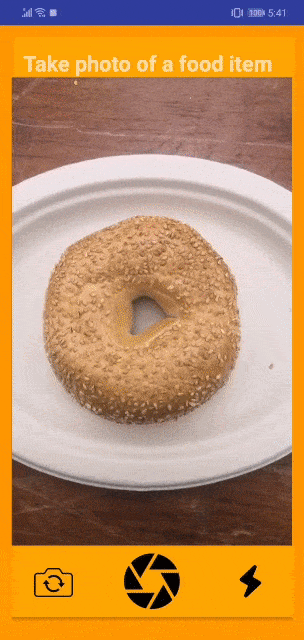

# Healthy.ly

An android app that can show if a food is allergic to you just by clicking its picture. It can likewise demonstrate it's health benefits, ingredients and recipes.

## Working

 

## Inspiration

We are a group of students from India. The food provided here are completely new to us and we don't know the ingredients. One of our teammate is dangerously allergic to seafood and he has to take extra precautions while eating at new places. So we wanted to make an app which can detect if the given food is allergic or not using computer vision.

We also got inspiration from the HBO show **Silicon Valley**, where a guy tries to make a **Shazam for Food** app.

Over time our idea grew bigger and we added nutritional value and recipes to it.

## What it does

This is an android app that uses computer vision to identify food item in the picture and shows you if you are allergic to it by comparing the ingredients to your restrictions provided earlier. It can also give the nutritional values and recipes for that food item.

## How we built it

We developed a deep learning model using **Tensorflow** that can classify between 101 different food items. We trained it using the **Google Compute Engine** with 2vCPUs, 7.5 GB RAM and 2 Tesla K80 GPU. This model can classify 101 food items with over 70% accuracy.
 
From the predicted food item, we were able to get its ingredients and recipes from an API from rapidAPI called "Recipe Puppy". We cross validate the ingredients with the items that the user is allergic to and tell them if its safe to consume.
 
We made a native **Android Application** that lets you take an image and uploads it to **Google Storage**. The python backend runs on **Google App Engine**. The web app takes the image from google storage and using **Tensorflow Serving** finds the class of the given image(food name). It uses it's name to get its ingredient, nutritional values and recipes and return these values to the android app via **Firebase**.
 

The Android app then takes these values and displays it to the user. Since most of the heavy lifting happens in the cloud, our app is very light(7MB) and is **computationally efficient**. It does not need a lot of resources to run. It can even run in a cheap and under performing android mobile without crashing.

## Challenges we ran into

> 1. We had trouble converting our tensorflow model to tflite(tflite_converter could not convert a multi_gpu_model to tflite). So we ended up hosting it on the cloud which made the app lighter and computationally effecient.
> 2. We are all new to using google cloud. So it took us a long time to even figure out the basic stuffs. Thanks to the GCP team, we were able to get our app up and running.
> 3. We couldn't use the Google App Engine to support tensorflow(we could not get it working). So we have hosted our web app on Google Compute Engine
> 4. We did not get a UI/UX designer or a frontend developer in our team. So we had to learn basic frontend and design our app.
> 5. We could only get around 70% validation accuracy due to the higher computation needs and less available time.
> 6. We were using an API from rapidAPI. But since yesterday, they stopped suport for that API and it wasn't working. So we had to make our own database to run our app.
> 7. Couldn't use AutoML for vision classification, because our dataset was too large to be uploaded.
 

## What we learned

Before coming to this hack, we had no idea about using cloud infrastructure like Google Cloud Platform. In this hack we leaned a lot about using Google Cloud Platform and understand its benefits. We are pretty comfortable using it now.

Since we didn't have a frontend developer we had to learn that to make our app.

Making this project gave us a lot of exposure to **Deep Learning**, **Computer Vision**, **Android App development** and **Google Cloud Platform**.

## What's next for Healthy.ly

1. We are planning to integrate **Google Fit** API with this so that we can get a comparison between the amount of calories taken and the amount of calories burnt to give better insight to the user. We didn't do it now due to time constraints.
 
2. We are planning to integrate **Augmented Reality** with this app to make it predict in real-time and look better.
 
3. We have to improve the **User Interface** and **User Experience** of the app.
 
4. Spend more time training the model and **increase the accuracy**.
 
5. Increase the **number of labels** of the food items.